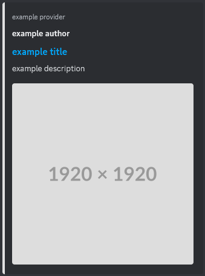

# What is it?
Embed Server is an open-source media hosting server for sharing custom embedded media in social platforms like Discord, Telegram, Twitter, and anything that uses [Open Graph Protocol](https://ogp.me/) and/or [oEmbed](https://oembed.com/).
It can host media from multiple users utilizing a account management system.



# Installation
To install Embed Server simply run
```
git clone https://github.com/rafa-br34/Embed-Server.git
cd Embed-Server
npm install
```
Run `npm start` to start the web-server
Use `nano DATA/Config.json` or `notepad DATA/Config.json` to edit configs.

# Setting up SSL
Some social media services don't download media from domains without SSL (which would render this project useless).
For instance, Discord's proxy only requests video sources from HTTPS servers.

To set up SSL you will need to first get the certificate, for that you can use something like [Let's Encrypt](https://letsencrypt.org/) or [ZeroSSL](https://zerossl.com/).
After getting the certificate you can place `private.key` and `certificate.crt` inside the `DATA` directory.
